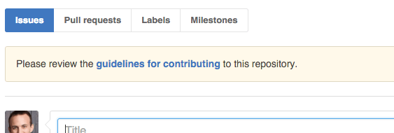

# Contributing

**Working on your first Pull Request?** You can learn how from this *free* series
[How to Contribute to an Open Source Project on GitHub](https://egghead.io/series/how-to-contribute-to-an-open-source-project-on-github)

You **always** want to look at this file *before* contributing. In here you should find
steps that you need to take to set up your development environment as well as instructions
for coding standards and contributing guidelines.

You'll notice that when this file is present, GitHub will give you an alert when creating
a new issue, indicating that you should check out the guidelines first:

## Acceptable Contributions

This package's purpose is really kind of useless as a node package. I created it to
demonstrate how to contribute to Open Source projects. However, I still have standards!
I only accept pull requests that:

- fix bugs for existing functions
- enhance the API or implementation of an existing function
- adds a function that is only slightly modified from a StackOverflow answer
- is tested (see the `test` directory; we use [`ava`](http://npm.im/ava))

In the case of adding a new function, that function must:

- NOT add anything to the prototype of built-in objects (one of StackOverflow's favorite things to do)
- be exported in the `src/index.js` file
- document where the original source came from

All code must follow the styles dictated by ESLint. As long as you don't skip the git hooks,
you shouldn't need to worry about missing something.

Also, **please discuss any changes in the issues** before working on a PR to make sure
that I'll accept it before you spend time working on it.

## Set up instructions

First of all, this is a JavaScript project that's distributed on [npmjs.org](https://npmjs.org) and
therefore uses JavaScript tooling based on [Node.js](https://nodejs.org/) with dependencies from npm.
You're going to need to have those things installed to contribute to this project.

1. Fork the repo
2. Clone your fork
3. Create a branch
4. Run `npm install`
5. Run `npm t && npm run build`. If everything works, then you're ready to make changes.
6. Run `npm run test:watch`. See that it's watching your file system for changes.
7. Make your changes and try to make the tests pass. If you can't or need help then commit what you have with `--no-verify` and make a PR
8. If you get things working, add your changed files with `git add` and run `npm run commit` to get an interactive prompt for creating a commit message that follows [our standards](https://github.com/ajoslin/conventional-changelog/blob/master/conventions/angular.md). You'll notice that there are git hooks in place which will run testing, linting, etc. (unless you commit with `--no-verify`).
9. Push your changes to your fork with `git push`
10. Create a pull request.
11. Iterate on the solution.
12. Get merged! 🎉 🎊

## Commit messages

We follow a convention for our commit messages, to learn about why and how, see [this free egghead.io series](http://kcd.im/write-oss)

